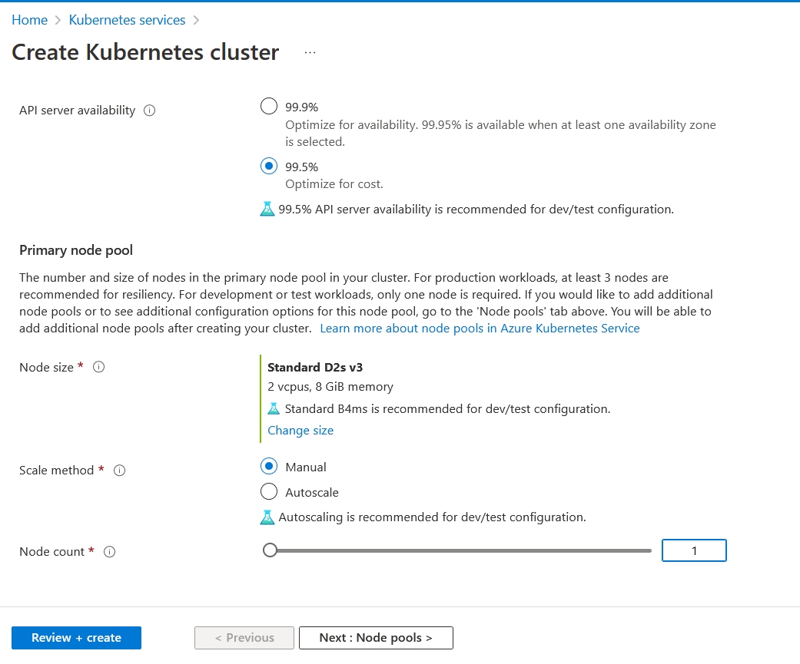
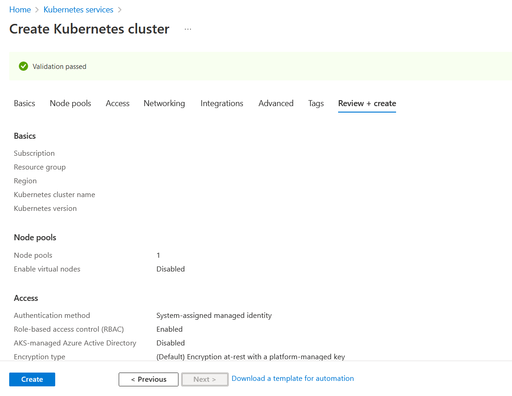
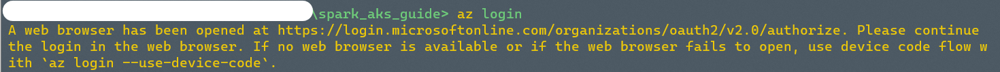
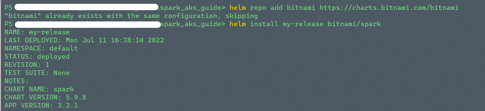
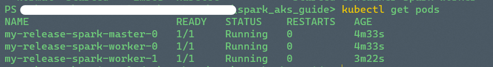
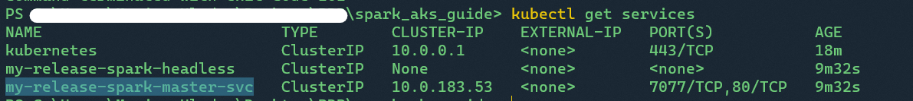
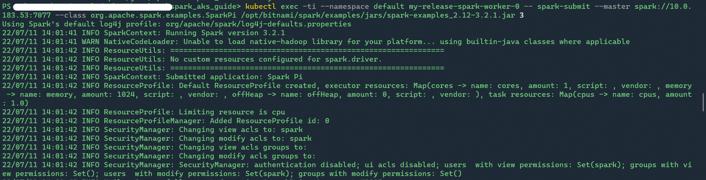
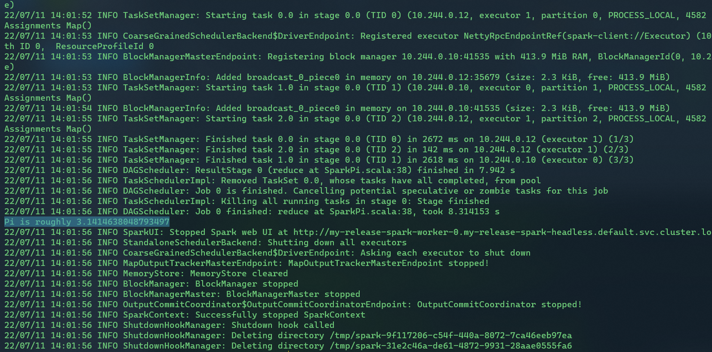
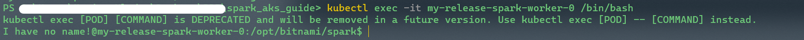

#### Deploy spark cluster on k8s using helm chart, read csv using spark-submit.

**Prerequisites:**
- azure cli
- helm
- kubectl
In my case I will be using Azure AKS cluster.
Create the cheapest AKS cluster for test purposes with single node and the smallest instance shape.

Click create and wait until AKS resource will be created.

Open your terminal and `az login` to your azure subscription.

After that get credentials for your freshly created AKS cluster. `az aks get-credentials -n <cluster name> -g <your resource group> [--subscription <your subscription name>]`


Now we will deploy spark cluster using helm chart on our AKS cluster.
```
helm repo add bitnami https://charts.bitnami.com/bitnami
helm install my-release bitnami/spark
```

Check your deployment with `kubectl get pods`:

Get IP of spark-master-svc service `kubectl get services`:

Test spark using this command:
```
kubectl exec -ti --namespace default my-release-spark-worker-0 -- spark-submit --master spark://<spark-master-svc Cluster IP here>:7077 --class org.apache.spark.examples.SparkPi /opt/bitnami/spark/examples/jars/spark-examples_2.12-3.2.1.jar 3
```

We ran 3 tasks for calculating Pi number using spark, here is the result of one of the tasks:


**Now we will read csv using spark-submit:**

Connect to one of the worker pods:
```
kubectl exec -it my-release-spark-worker-0 /bin/bash
```

Then run on pod:
```
mkdir /tmp/spark
cd /tmp/spark

curl -L https://raw.githubusercontent.com/ | tac | tac >> zipcodes.csv
curl -L https://raw.githubusercontent.com/ | tac | tac >> readcsvspark.py

kubectl exec -ti --namespace default spark-release1-worker-0 -- spark-submit --master spark://<spark-master-svc Cluster IP here>:7077 --class org.apache.spark.examples.SparkPi /tmp/spark/readcsvspark.py 1
```

Useful links:
https://artifacthub.io/packages/helm/bitnami/spark
https://sparkbyexamples.com/pyspark/pyspark-read-csv-file-into-dataframe/


